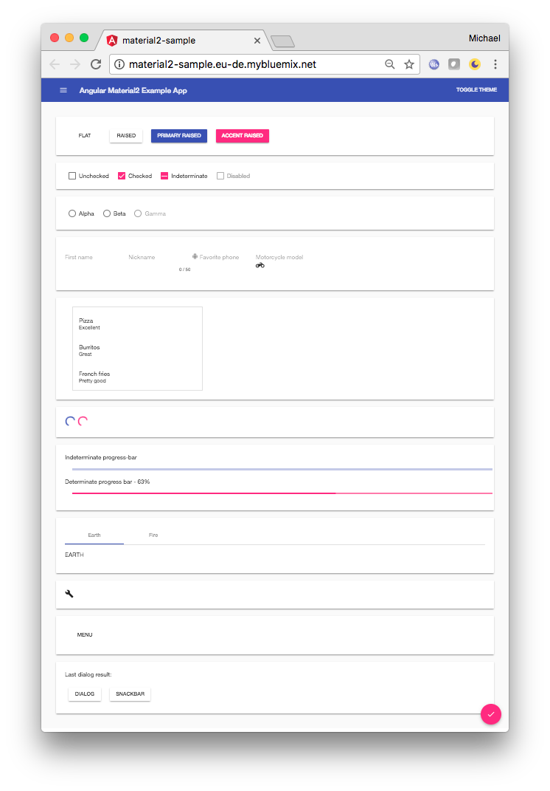

## material2-app

[](https://greenkeeper.io/)
[](https://travis-ci.org/m67hoff/material2-sample)
[](https://david-dm.org/m67hoff/material2-sample)
[](https://david-dm.org/m67hoff/material2-sample?type=dev)

---

Simple app that consumes Angular Material 2 components. Built with the `angular-cli`.

NOTE: This is an updated version of the original:
https://github.com/jelbourn/material2-app


**See it live:**  http://material2-sample.eu-de.mybluemix.net

#### local install:
```
git clone https://github.com/m67hoff/material2-sample
cd material2-sample
npm i
ng s
```
#### Changes to original:
- update to material2 beta8 (include @angular/cdk)
- update to Angular 4.2.5 
- update to Angular-cli 1.2 (including generated files) 
- replace deprecated import of MaterialModule  (-> split to seperate import for each componet)
- replace deprecated use of `<md-input>` and `<md-sidenav-layout>` with `<md-input-container>` and `<md-sidenav-container>` 
- add theming as described in https://material.angular.io/guide/theming  including Multiple themes and theme for overlay-based components
- replace deprecated import of MaterialModule  (-> split to seperate import for each componet)
- detach from fork jelbourn/material2-app because its not active maintained anymore [jelbourn comment](https://github.com/jelbourn/material2-app/pull/47#issuecomment-305238701) 
- some code cleaning (e.g.`<md-icon>` use, css file sorted, ...)

---
#### ToDo
- travis should run the tests 

---
#### Screenshot

